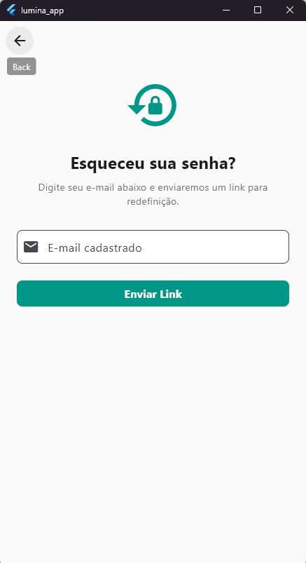
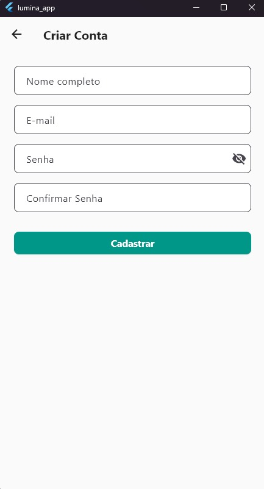
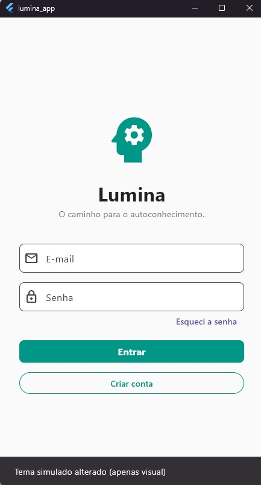
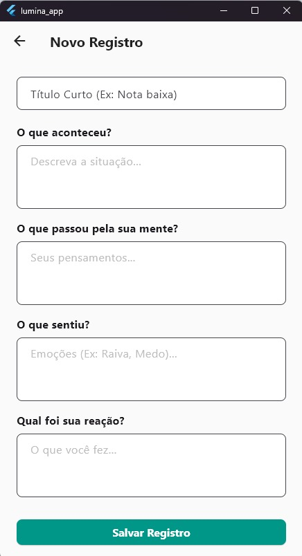
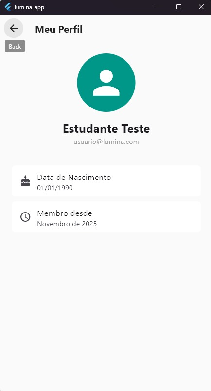
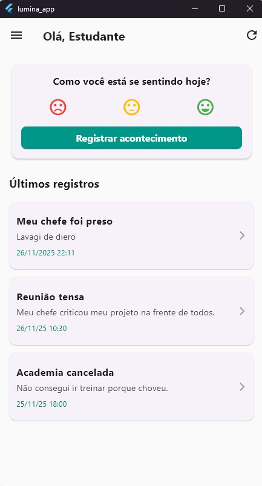

# Lumina – Aplicativo de Autoconhecimento baseado em TCC

O **Lumina** é um aplicativo desenvolvido em Flutter com foco em autoconhecimento emocional. Baseado em princípios da **Terapia Cognitivo-Comportamental (TCC)**, o app permite registrar situações, emoções, pensamentos automáticos e respostas racionais para auxiliar o usuário a lidar melhor com situações do dia a dia.

---

## 🎯 Objetivo

Oferecer um diário estruturado que ajude o usuário a organizar seus pensamentos e emoções, promovendo clareza emocional e desenvolvimento pessoal.

---

## 🧠 Funcionalidades

- Registro de situação vivida  
- Identificação e intensidade da emoção  
- Pensamentos automáticos  
- Resposta racional (reestruturação cognitiva)  
- Histórico de registros  
- Interface moderna com Material Design 3  

---

## 🛠️ Tecnologias Utilizadas

**Framework:**  
- Flutter 3.x

**Linguagem:**  
- Dart 3.x

**Interface (UI):**  
- Material Design 3 (Material You)

**Gerenciamento de Estado:**  
- Nativo (StatefulWidget + setState)

---

## 📂 Layout

